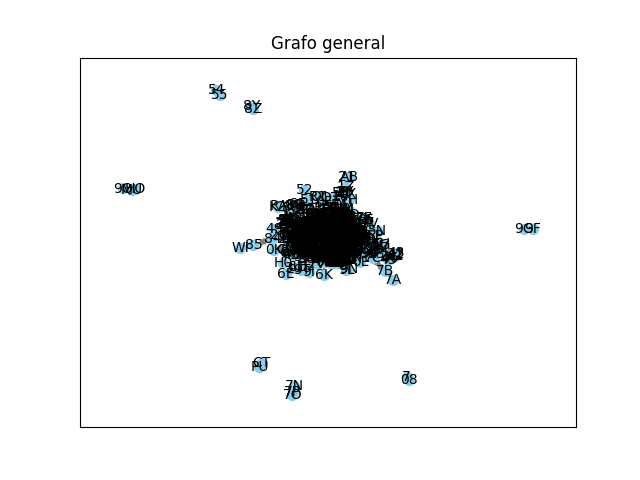
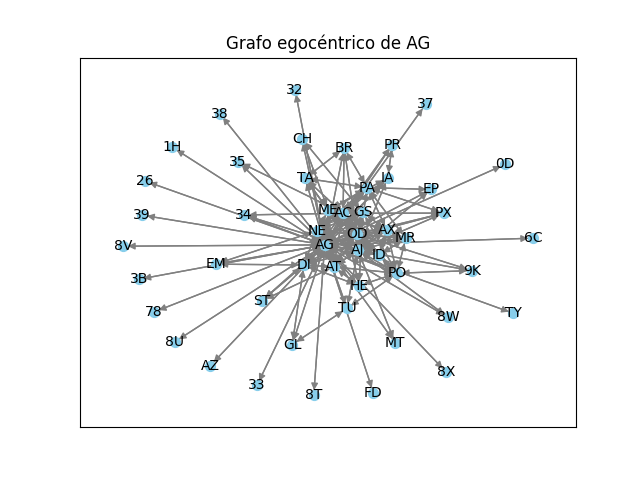
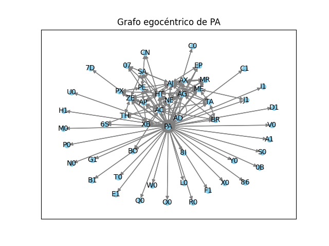
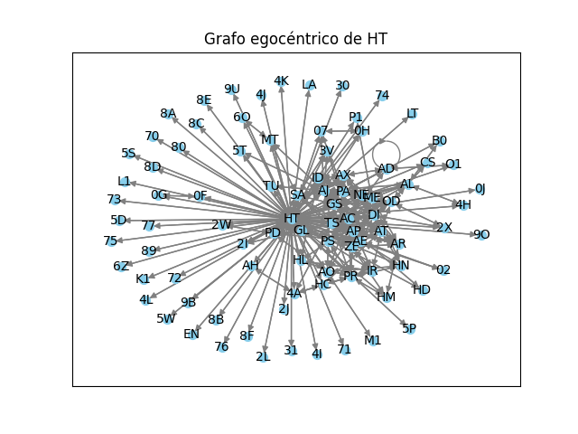

# Sistemas de Información para la Web
## PageRank
### Descripción
<p text-align="justify">
    Práctica 5, correspondiente a PageRank, que se basa en la búsqueda de los personajes más importantes de una red, la generación de un grafo egocéntrico de un personaje de esta red y, por último, la comparación entre 2 personajes y la creación de clusters sobre los personajes con mayor relación de la red. 
</p>

### Forma de uso
<p text-align="justify">
    Para utilizarlo es necesario el paso de 5 parámetros, los cuales son:
</p>

* _social_network_file:_ nombre del archivo donde se encuentran los personajes de la red social y sus relaciones
* _ego_character:_ nombre del personaje sobre el que generar el grafo egocéntrico.
    * valor por defecto: *AG*.
* _character_1:_ nombre del primer personaje a comparar.
    * valor por defecto: *PA*.
* _character_2:_ nombre del segundo personaje a comparar.
    * valor por defecto: *HT*.
* _g:_ variable booleana para indicar si se desean visualizar los primeros grafos del script.
    * valor por defecto: *True*.

#### Ejemplo de uso
```bash
  PageRank.py files/iliada.txt -ego_character=AG -character_1=PA -character_2=HT -g
```

### Decisiones tomadas.
<p text-align="justify">
  Para comenzar, en cuanto a la creación del diccionario de la red social, se ha optado por la utilización de los pesos de las aristas, los que posteriormente se pasarán al grafo dirigido, el cual será utilizado en la mayoría de los procesos siguientes .
</p>
<p text-align="justify">
  También se ha decidido, que la lista de personajes más importantes a mostrar sea de 7 personajes, por no sobresaturar la salida por consola.
</p>
<p text-align="justify">
  Con respecto a la muestra de los clusters, en caso de que un personaje no forme parte de ningún cluster, originalmente se había planteado como no mostrarlo, pero al final se cambió para mostrar también a aquellos personajes independientes (tal y como el ejemplo puesto en clase de Spider-Man para la colección de Marvel). 
</p>
<p text-align="justify">
  Por último, como decisión e implementación personal, se ha optado por el uso de una función para dibujar los grafos (lo que se puede seleccionar con el parámetro <em>g</em> mencionado anteriormente), de forma que utilizando pyplot muestre estos grafos creados, aunque para el primero, al ser para toda la red social, apenas será posible distinguir los nodos. Sin embargo, para los próximos esto ya no sucede, como se puede ver en las imágenes de abajo.
</p>
<p style="display: flex; gap: 2em" text-align="center">
  
  
  
  
</p>
<p text-align="justify">
  Cabe mencionar, que en cierto punto del script, antes de la creación de los clusters, se ha optado por desactivar la visualización de los grafos, ya que al haber tantas comparaciones y tantos grafos creados, podría haber, o, mejor dicho, hay problemas en la ejecución debido a una sobrecarga de recursos.
</p>

### Ejemplos de salidas 
Para la entrada escrita anteriormente, la salida sería la siguiente (además de los grafos ya mostrados):
#### Creación del grafo general y los personajes más importantes
````
-> Grafo general: DiGraph with 557 nodes and 2021 edges
  Drawing...
    * Personajes más importantes:
      1. HT: 0.0476868002631133
      2. AC: 0.03234434535212086
      3. AG: 0.029599722974742868
      4. AJ: 0.025381608086108634
      5. PA: 0.02446655025330172
      6. ZE: 0.021455404916238357
      7. DI: 0.020971950035531914
````
#### Creación de un grafo egocéntrico y los personajes con más relación con el protagonista
````
-> Grafo egocéntrico de AG: DiGraph with 49 nodes and 286 edges
  Drawing...
    * Personajes más importantes:
      1. AG: 0.2006843381379649
      2. AJ: 0.0703625160435015
      3. AC: 0.05886726129569359
      4. NE: 0.05227239205203635
      5. DI: 0.04745327055281839
      6. OD: 0.04353582808622005
      7. AT: 0.04213593871958474
````
#### Comparación entre PA y HT
````
COMPARACIÓN DE PERSONAJES:
 -> Grafo egocéntrico de PA: DiGraph with 53 nodes and 233 edges
   Drawing...
     * Personajes más importantes:
       1. PA: 0.20588070238685707
       2. AG: 0.07653447362478394
       3. AC: 0.07573042626086661
       4. AJ: 0.06159196263641227
       5. HT: 0.05649569649489642
       6. NE: 0.04447005118304148
       7. ME: 0.033045113516383104
 -> Grafo egocéntrico de HT: DiGraph with 90 nodes and 481 edges
   Drawing...
     * Personajes más importantes:
       1. HT: 0.21284046647387034
       2. AJ: 0.051486320262444624
       3. AC: 0.036426130608605486
       4. AT: 0.02999176893822698
       5. TS: 0.027662917598515697
       6. ME: 0.027202177791135606
       7. DI: 0.025267869385953653
 La similitud entre PA y HT (valor del coseno) es 0.17374889710522776
````
#### Generación de los clusters de personajes
````
CLUSTERS DE PERSONAJES:
  - PX: {}
  - NE: {'AX': 0.45753968194423666, 'ME': 0.4173111630559929}
  - ID: {'GS': 0.41039134083406165, 'MR': 0.450563556889583, 'AX': 0.5007733956671915}
  - PD: {}
  - GS: {'ID': 0.41039134083406165, 'AP': 0.4225771273642583, 'TS': 0.5965587590013045, 'AT': 0.4982728791224398, 'AX': 0.4880935300919764}
  - MG: {}
  - 9B: {}
  - AP: {'GS': 0.4225771273642583, 'TS': 0.5041841733655162, 'AT': 0.49130368444051753, 'ZE': 0.4498677054212187, 'AE': 0.47280542884465016, 'AR': 0.4536323543632774}
  - IR: {'XB': 0.4029114820126901}
  - GL: {'SA': 0.4036036763977875}
  - OD: {}
  - AF: {'HE': 0.4125143236626951}
  - TS: {'GS': 0.5965587590013045, 'AP': 0.5041841733655162, 'AT': 0.49541508402214945, 'HT': 0.40904799405193093, 'SA': 0.4117647058823529}
  - HR: {}
  - BL: {}
  - AT: {'GS': 0.4982728791224398, 'AP': 0.49130368444051753, 'TS': 0.49541508402214945, 'HE': 0.49130368444051753, 'DI': 0.42980119129593963, 'AE': 0.428845013935118, 'AR': 0.40522044923655387, 'AX': 0.40533961419994047}
  - PR: {}
  - HE: {'AF': 0.4125143236626951, 'AT': 0.49130368444051753, 'ZE': 0.502793317823715, 'OG': 0.4879500364742666, 'AR': 0.4123930494211613, 'PO': 0.42111744380615784}
  - TH: {}
  - 06: {}
  - ZE: {'AP': 0.4498677054212187, 'HE': 0.502793317823715}
  - DI: {'AT': 0.42980119129593963}
  - HT: {'TS': 0.40904799405193093}
  - AD: {'XB': 0.40201512610368484}
  - EA: {}
  - AC: {}
  - AE: {'AP': 0.47280542884465016, 'AT': 0.428845013935118}
  - OG: {'HE': 0.4879500364742666}
  - PS: {}
  - PE: {'XB': 0.5454545454545454}
  - XB: {'IR': 0.4029114820126901, 'AD': 0.40201512610368484, 'PE': 0.5454545454545454}
  - DP: {}
  - TM: {}
  - MR: {'ID': 0.450563556889583, 'AX': 0.4763305116224668, 'ME': 0.46019501151311265}
  - HP: {}
  - AR: {'AP': 0.4536323543632774, 'AT': 0.40522044923655387, 'HE': 0.4123930494211613}
  - AM: {}
  - AJ: {'AX': 0.48019603839902475, 'AG': 0.4242640687119285}
  - TU: {}
  - HM: {}
  - HL: {}
  - PA: {}
  - AL: {}
  - AX: {'NE': 0.45753968194423666, 'ID': 0.5007733956671915, 'GS': 0.4880935300919764, 'AT': 0.40533961419994047, 'MR': 0.4763305116224668, 'AJ': 0.48019603839902475, 'ME': 0.43278921145054855}
  - 8R: {}
  - PB: {}
  - PO: {'HE': 0.42111744380615784}
  - AG: {'AJ': 0.4242640687119285}
  - SA: {'GL': 0.4036036763977875, 'TS': 0.4117647058823529}
  - ME: {'NE': 0.4173111630559929, 'MR': 0.46019501151311265, 'AX': 0.43278921145054855}
````